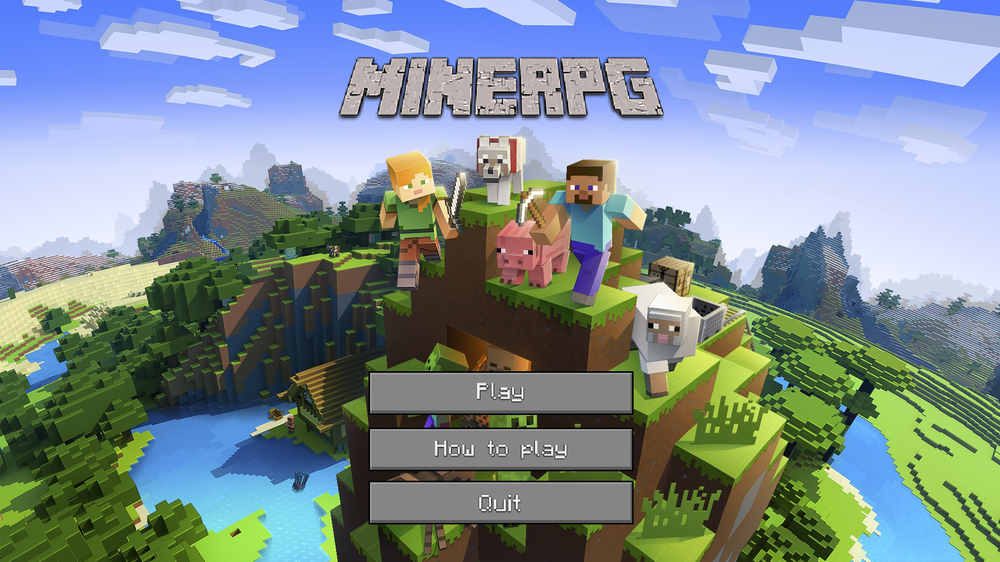
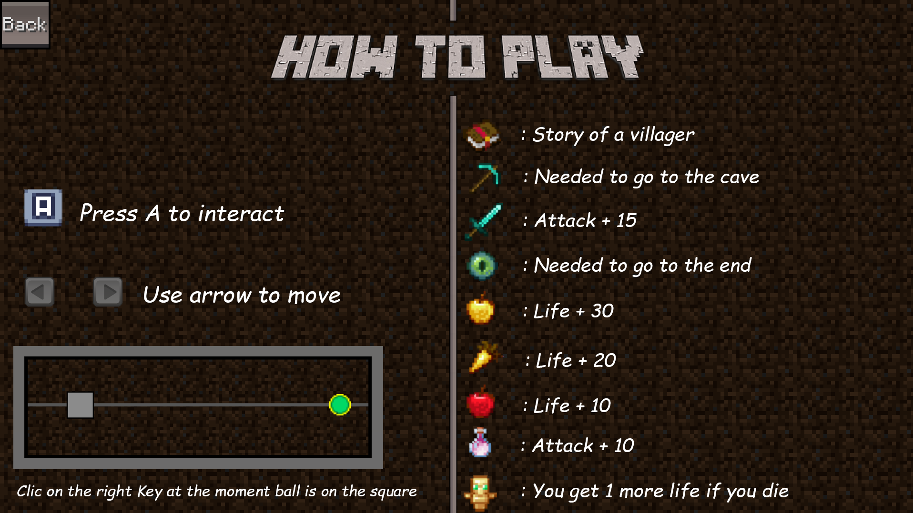

# MY_RPG
**`1st year graphic project, Create a rpg in C with CSFML library.`**

## Subject

Create your own RPG.

Your main challenge for this game will be to create a complete product using everything that you and your
team know.

Your game must follow the following rules:
- The player needs to have characteristics which you can find in the status menu.
- The player can fight enemies, statistics will impact the fights results.
- There must be NPC in your game.
- You need to implement at least one quest.
- The player must have an inventory which can contain a limited set of items.
- The player can earn experience by winning fights and accomplishing specific actions.
- With enough experience, the player can level up, upgrading its statistics.

To give the users the feeling that you’re delivering a complete product you need to polish as much as possible
your game.

- Having a pleasant user interface.
- Create a coherent universe (visual assets, audio assets, scenario, . . .)
- Create a funny game where the player has at least one goal.
- Create a game with a beginning and an end.

## REQUIREMENTS

* [GCC](https://gcc.gnu.org/)
* [Make](https://www.gnu.org/software/make/)
* [CSFML](https://www.sfml-dev.org/download/csfml/)

## How to run ?

### Compile
input
```bash
make
```
### Run
input
```bash
./my_rpg
```

## Title screen


## How to play ?


## Credit
### made with
[Mathis LEGRAND](https://github.com/MathisLegrandGit)
[Virgile ARNOUX](https://github.com/Virgile0110)
[Maxime GREGOIRE](https://github.com/maxperso)
